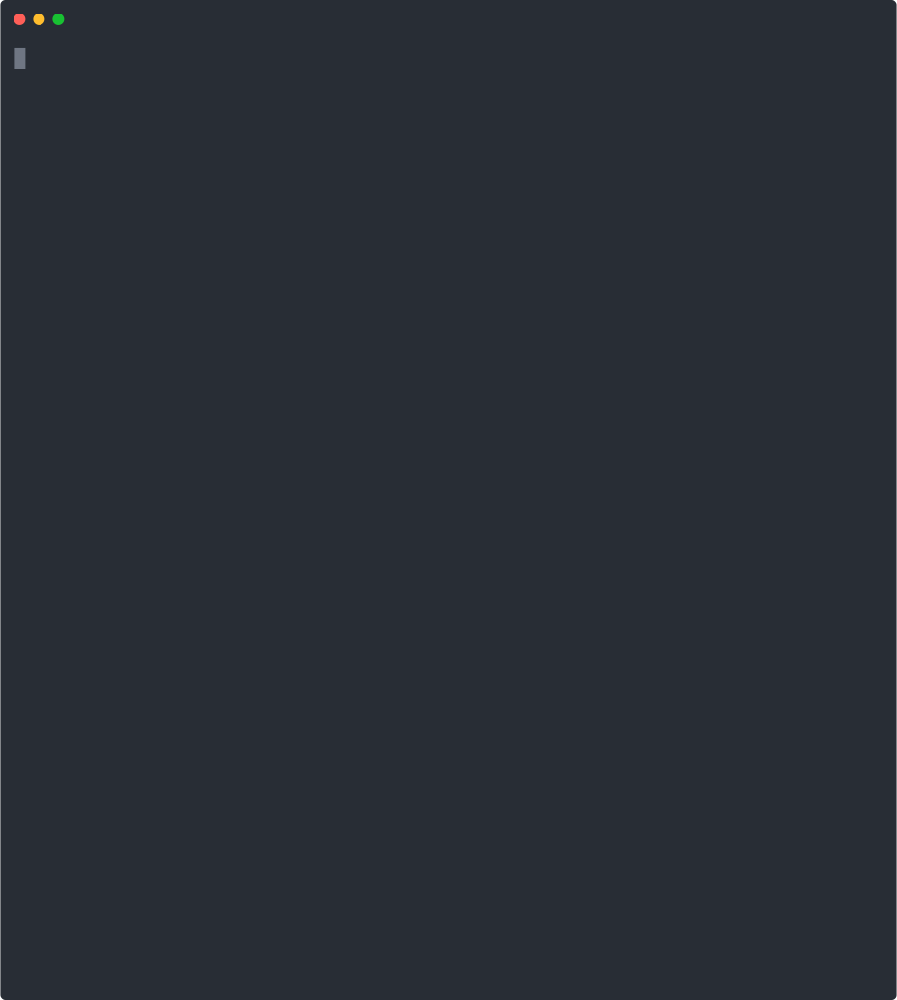

<p>
	
</p>

# Feer

**`Feer`** : Front-End Developer Integration. Fast built integrated tools based on [RollupJS](https://www.rollupjs.com/). &ensp;🚀 

> The naming inspiration comes from **`F`** ront- **`E`** nd&ensp; Engine **`er`**, that is "FEer", &ensp;such as "PHPer"、 "JAVAer"

[**中文**](./README.md)

<p align='center'>
  
</p>

### commander

- global
```bash
npm i feer-cli -g
```
- usage
```
feer <project-name>
```
- or
```bash
npx feer-cli <project-name>
```

### support PC and H5 scenario selection.

During the creation process using the `feer` command, 
template selection is provided:

```bash
? Which type do you want to create? (Use arrow keys)
❯ PC - (build the pc page)
  H5 - (build the h5 page)
```

## directory structure

```c
├── .babelrc ---> Babel configuration file
├── .gitignore ---> Git filtering rule
├── .eslintrc ---> ESLint configuration file
├── .eslintignore ---> ESLint filtering rule
├── README.MD
├── package.json
├── build ---> Output folder
├── config ---> Configuration folder(`*`)
├── views ---> Nunjucks template engine
├── imgs ---> Image resource file (this folder can be deleted when using CDN)
└── src ---> Source folder
```

### configuration folder

```c
├── build.js ----> Nunjucks template processing
├── server.js ----> Fastify static server, routing processing
└── rollup.config.js ---> RollupJS configuration file, configurable environment variables
```

### source folder

```c
├── libs ---> Can store incoming third party library files
├── mods ---> Module business logic
├── index.js ---> The entry file: index.js
└── styles ---> Sass, Source code folder, customizable
```

### build 文件夹

```c
├── index.html ---> Html template file
├── js ---> Javascript source folder
├── css ---> Css source folder
└── img ---> Image resource file (this folder can be deleted when using CDN)
```


<!-- ### features

* 

 -->

### License

[MIT](./LICENSE)
 

